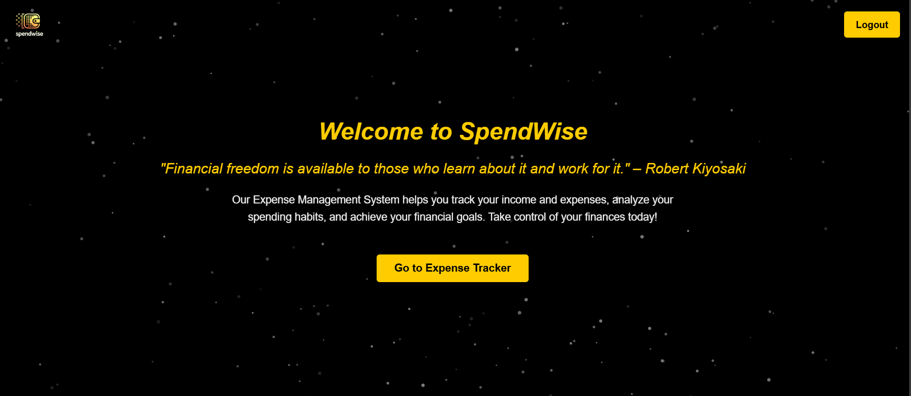

# SpendWise

This repository contains the frontend components of an **SpendWise** built using React, React Bootstrap, and other modern web technologies. The application allows users to track their expenses, manage budgets, and view financial insights.

## Features

### 1. **Login Page**
   - User authentication with email and password.
   - Background image with `tsparticles` animation for a modern look.
   - Form validation and error handling.
   - Toast notifications for success and error messages.

### 2. **Registration Page**
   - User registration with name, email, and password.
   - Consistent design with the Login page (background image, particles, and styling).
   - Form validation and error handling.
   - Toast notifications for success and error messages.

### 3. **Home Page**
   - Displays a welcome message and a brief description of the application.
   - Redirects unauthenticated users to the login page.
   - Features a button to navigate to the **Expense Tracker** page.
   - Background image with an overlay for better readability.

### 4. **Add Transaction Modal**
   - Allows users to add new transactions (income or expenses).
   - Includes fields for title, amount, category, description, transaction type, and date.
   - Form validation to ensure all fields are filled.
   - Toast notifications for success and error messages.

### 5. **TableData Page**
   - Displays a table of all transactions (income and expenses).
   - Provides options to view, edit, or delete transactions.
   - Responsive design for all screen sizes.
   - Download report option

### 6. **Analytics Page**
   - Visual representation of expenses and income using charts or graphs.
   - Displays insights such as total income, total expenses, and net balance.
   - Categorizes expenses for better financial analysis.

### 7. **Navbar Component**
   - Responsive navigation bar with a logo and login/logout buttons.
   - Dynamic rendering based on user authentication status.
   - `tsparticles` animation in the background for a cohesive design.

### 8. **Styling**
   - Consistent color scheme (gold accents, dark theme).
   - Semi-transparent containers for better readability.
   - Responsive design for all screen sizes.

## Technologies Used
- **React**: Frontend library for building user interfaces.
- **React Bootstrap**: UI framework for responsive and pre-styled components.
- **tsparticles**: Library for creating interactive particle animations.
- **React Router DOM**: For handling client-side routing.
- **React Toastify**: For displaying toast notifications.
- **Axios**: For making HTTP requests to the backend.
- **Chart.js** or **Recharts**: For visualizing financial data on the Analytics page.

## screenshots

